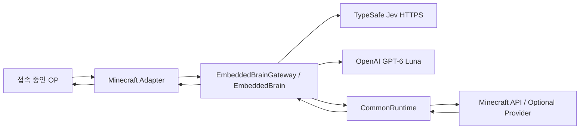

# Minecraft JARVIS 아키텍처

갱신일: 2026-09-27  
범위: Paper, Fabric, NeoForge Adapter와 JVM 내부 Embedded Brain의 현재 구조.

## 현재 구조

JARVIS는 별도 Node/Brain daemon 없이 Minecraft 서버 JVM 안에서 동작한다. 접속 중인 OP의 채팅 입력은 플랫폼 Adapter가 권한을 확인한 뒤 `EmbeddedBrainGateway`로 전달한다. Embedded Brain은 Jev 분류, deterministic Tool narrowing, GPT-6 Luna Tool loop, 감사, 예산과 queue를 JVM 내부에서 수행한다.



WebSocket, shared-secret authentication, hello/capabilities handshake, ping/pong, reconnect generation, 별도 Brain process registry는 E13/E14에서 제거되었다.

## 구성 요소

| 구성 요소 | 책임 |
|---|---|
| `minecraft/common` | `BrainGateway`, `EmbeddedBrain`, Jev/Luna client, route policy, conversation history, request budget/scheduler, audit, Tool argument validation, `CommonRuntime`, Tool registry, authority/deadline/deduplication |
| `minecraft/paper` | Paper entrypoint, chat/session integration, scheduler/platform access, standard Tool, CoreProtect/WorldGuard/CMI optional Provider |
| `minecraft/fabric` | Fabric dedicated-server entrypoint, chat controller, scheduler/platform access, standard Tool |
| `minecraft/neoforge` | NeoForge dedicated-server entrypoint, chat controller, scheduler/platform access, tick sampler, standard Tool |
| `protocol/schema`, `protocol/fixtures` | 과거 Remote wire contract와 호환성/회귀 분석을 위해 보존하는 정적 계약 자산 |
| `evals` | Jev 평가 데이터와 E12 policy parity fixture |
| `tests/acceptance/out` | T10에서 수집된 과거 live acceptance evidence snapshot |

## 요청 흐름

1. 플랫폼 Adapter가 현재 플레이어가 online OP인지 확인하고 `ChatSessionManager`에서 직접 호출/후속 대화/session 종료를 판정한다.
2. `EmbeddedBrainGateway`가 request를 생성해 bounded `AiRequestScheduler`로 넘긴다.
3. Jev가 latest message, short topic, capability 이름만 받아 category를 분류한다.
4. `DeterministicRoutePolicy`가 active Tool set을 category에 맞게 좁힌다. Jev 오류, `UNCERTAIN`, 저신뢰 fallback에서는 read-only Tool만 노출한다.
5. Luna는 허용된 Tool schema만 보고 Tool call을 제안한다.
6. Tool 인자는 공용 `ToolArgumentCodec`으로 다시 strict parsing된다. 모델 출력은 실행 권한이 아니다.
7. 상태 변경 Tool은 pre-execution audit 성공 후에만 `CommonRuntime.ExecutionRuntime`으로 전달된다.
8. `CommonRuntime`이 current OP, active Tool, deadline, deduplication/action semantics를 재검사하고 플랫폼 scheduler에서 실제 Minecraft/Provider API를 호출한다.
9. Tool result를 Luna가 해석해 최종 답을 만든다.
10. `EmbeddedBrainGateway`는 server thread로 돌아가 current online OP와 active session을 다시 확인한 뒤 요청자에게만 응답한다.

## 권한과 안전 불변조건

- 권한의 source of truth는 Minecraft 서버의 현재 online + OP 상태다.
- Jev/Luna 출력, requester UUID 문자열, capability 이름은 권한 증거가 아니다.
- Tool은 현재 `ToolRegistry`에 실제 등록된 경우에만 활성화된다.
- unknown/missing Tool argument field, 잘못된 UUID/range/selector는 거부한다.
- session별 요청 직렬화와 bounded queue를 유지한다.
- request당 Tool 최대 8회, 모델 왕복 최대 4회, 전체 deadline 30초를 유지한다.
- 상태 변경 Tool은 audit fail-closed다.
- 상태 변경 결과가 deadline 안에 확정되지 않으면 `OUTCOME_UNKNOWN`이며 자동 retry하지 않는다.
- deop/logout/session end 후 stale Tool 실행과 stale reply를 차단한다.
- optional Provider가 성공적으로 활성화되지 않으면 그 Provider Tool은 Luna에 노출하지 않는다.

## Session과 conversation state

`ChatSessionManager`가 session ID, TTL, active 여부, 종료와 invalidation을 단독 소유한다. Embedded Brain은 별도의 session TTL store를 만들지 않고 `ConversationHistoryStore`에 모델 대화 이력만 보관한다.

기본 session TTL은 120초다. 직접 호출어는 `자비스`, `jarvis`, `재비스`이며, `대화 끝`과 `!내용`은 Adapter에서 로컬 처리한다.

## Tool 경계

정적 Tool metadata는 `Protocol.ToolName`, 현재 활성 Tool set은 `ToolRegistry`가 소유한다. v0.1의 상태 변경 Tool은 요청자 본인을 온라인 대상 플레이어 위치로 이동하는 `teleport_staff`뿐이다.

CoreProtect, WorldGuard, CMI 기능은 Paper에서 optional Provider로 로딩하며 초기화 실패/의존성 부재 시 관련 Tool을 등록하지 않는다.

## AI와 스레드 경계

Jev와 Luna 네트워크 호출은 Minecraft server/tick thread를 점유하지 않는다. 플랫폼 API 호출만 각 플랫폼의 scheduler/execution context에서 수행한다. 외부 AI에는 요청 처리에 필요한 최소 대화, capability 이름, Tool schema, bounded Tool result만 전달한다.

## 감사

Embedded Brain의 `AsyncJsonlAuditSink`는 bounded queue, JSONL rotation/retention, masking과 health 상태를 제공한다. state-changing Tool의 pre-execution record가 실제 저장되지 않으면 실행을 거부한다. post-execution audit 실패는 이미 실행된 Tool을 retry하게 만들지 않는다.

## E12-E14 전환 결과

- E12: Remote reference와 Embedded Java가 같은 shared parity fixture를 통과하도록 정책 회귀 테스트를 추가했다.
- E13: WebSocket transport, shared-secret auth, protocol codec/message DTO, request-binding connection registry, 플랫폼 Remote wrapper/config를 제거했다.
- E14: TypeScript/Node production Brain, WebSocket server/daemon/CLI, Node CI job을 제거했다.
- protocol schema/fixtures, Jev 평가 데이터, E12 fixture, 과거 T10 evidence는 분석 및 회귀 기준으로 보존한다.

과거 Remote 전송 계약과 T10 결과는 역사적 검증 자료다. 현재 production runtime path에는 Node process나 WebSocket 연결이 존재하지 않는다.

## 빌드와 운영

현재 production build 기준은 Java 21 + Gradle이다.

```bash
./gradlew build
```

실제 provider live smoke는 credentials가 있을 때 별도 실행한다.

```bash
OPENAI_API_KEY=... TYPESAFE_API_KEY=... \
  ./gradlew :minecraft:common:embeddedBrainLiveVerification
```

구체적인 운영 설정과 장애 절차는 [operations.md](operations.md)를 따른다. Embedded 전환 결정은 [ADR-0007](decisions/0007-embedded-brain-boundary.md)에 기록한다.
