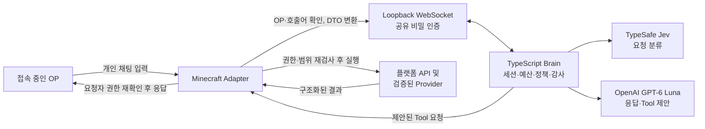

# Minecraft JARVIS 아키텍처

작성일: 2026-09-25
범위: Paper, Fabric, NeoForge 서버 Adapter와 TypeScript Brain 사이의 v0.1 구조, Paper v0.1.1 Provider 확장, T14 CMI 선택 Tool.
규범 문서: [`Minecraft_JARVIS_WORK_SPEC.md`](Minecraft_JARVIS_WORK_SPEC.md), [`protocol.md`](protocol.md), [`tools.md`](tools.md).

## 진행 상태와 읽는 방법

2026-09-25 동기화 기준 GitHub `main`, 로컬 `main`, `origin/main`은 모두 `8df2b04` (T10 acceptance merge)이며 commit divergence는 없다. 이 checkout에는 원격 T03~T10 구현과 acceptance assets가 있고, 작업 트리에는 T11~T14 Paper 확장이 추가되어 있다. T14는 사용자가 Zrips의 명시적 사용 허가를 받았다고 확인한 뒤 착수했다. CMI-API 9.8.6.4를 compileOnly로 사용하고, CMI 9.8.9.6 + CMILib 1.5.9.9의 실제 서버 smoke는 아직 남아 있다. 로컬 contract 검증과 third-party plugin runtime smoke는 서로 다른 증거다. 원격 merge 시점의 release gate는 [T10 acceptance report](https://github.com/Kardane/JarvisMinecraft/blob/8df2b04/docs/verification/T10_V01_REPORT.md)에 `PARTIAL`로 기록돼 있다.

`AGENTS.md`는 저장소 작업 지침이다. 이 문서는 원격 T10 구조와 현재 작업 트리의 T11~T14 상태를 분리해 기록한다. 현재 checkout 소스와 검증 결과는 아래 표를 기준으로 한다.

## 목적과 구성 요소

JARVIS는 접속 중인 OP의 직접 호출을 받아 Minecraft 서버의 제한된 정보를 조회하고, 허용된 단일 행위인 요청자 본인의 텔레포트를 처리한다. Brain은 모델과 대화 흐름을 관리한다. Adapter는 서버가 가진 권한과 현재 상태를 기준으로 모든 실제 접근과 변경을 집행한다.

| 구성 요소 | 책임 | 의존 경계 |
|---|---|---|
| Paper Adapter | `minecraft/paper`: plugin entrypoint/config, chat session/listener, scheduler/platform access, Tool service, Brain connection, optional Provider assembly | `IntegrationRegistry`가 CoreProtect와 WorldGuard를 enabled 상태 및 WorldEdit 의존성에 따라 선택 로딩한다. Provider Tool은 성공적으로 초기화된 경우에만 원자적으로 등록하며, 외부 API 연결 실패 시 미노출한다. |
| Fabric Adapter | `minecraft/fabric`: server mod entrypoint/config, chat session/controller, scheduler/platform access, tick sampler, Tool service, Brain connection | Fabric server API에 한정한다. 클라이언트 전용 API에 의존하지 않는다. |
| NeoForge Adapter | `minecraft/neoforge`: dedicated server mod entrypoint/config, chat session/controller, scheduler/platform access, tick sampler, Tool service, Brain connection | NeoForge dedicated server API를 사용한다. |
| Common Java | `minecraft/common`: protocol DTO/codec, connection runtime, deadline, deduplication ledger, requester authority, Tool registry, scheduler SPI, shared-secret WebSocket transport | Minecraft 플랫폼 API를 import하지 않는다. |
| Brain core | `brain/src/core`: actor/session binding, capabilities, serial request scheduler, budgets, Tool allowlist, model/audit ports | serverId/request/session identity를 분리해 관리한다. |
| AI routing | `brain/src/ai`: TypeSafe Jev classifier, deterministic route policy, GPT-6 Luna Responses Tool loop, strict Tool schemas | 모델 출력은 Tool 요청 제안이다. 최종 검사와 실행은 Adapter 경계에서 한다. |
| Brain operations/server | `brain/src/ops`, `brain/src/server`: config, secret masking, rotating JSONL audit, health, daemon composition, authenticated WebSocket server | Node 24 프로세스로 실행하고 v0.1 listener는 loopback에만 bind한다. |
| Protocol contract | `protocol/schema`, `protocol/fixtures`: message schema, capability와 Tool 인자·결과, 오류, valid/invalid examples | JSON Schema와 fixture manifest가 언어 간 계약 기준이다. |

## 연결 및 요청 흐름

1. Brain이 loopback 주소에서 WebSocket 서버를 연다. Adapter는 HTTP Upgrade의 `X-Jarvis-Secret` 헤더로 공유 비밀을 제시한다. 빈 값, 샘플 값, 인증 실패는 거부한다.
2. 연결이 인증되면 Adapter와 Brain이 `hello`를 교환한다. Adapter는 플랫폼 및 서버 버전을 알리고, Brain은 protocol 1.0을 수락한다. Adapter는 매 연결마다 현재 runtime에서 실제 사용 가능한 `capabilities`와 Tool 목록을 보낸다.
3. Adapter는 입력을 받기 전 현재 접속·OP 상태를 확인한다. `자비스`, `jarvis`, `재비스` 독립 호출어로 대화가 시작되며, OP별 세션은 직접 호출 후 120초간 유지된다. `대화 끝`, `!내용`, 비OP 채팅은 계약대로 처리한다.
4. Adapter는 실제 플레이어 UUID와 대화 입력을 `chat.message`로 보내고, Brain은 server/request/session/requester 바인딩과 직렬화·요청 한도를 확인한다. 이 정보는 식별 및 binding에 쓰이며 그 자체가 권한을 부여하지 않는다.
5. Jev는 요청을 분류한다. 분류 결과는 도구 후보를 좁힐 뿐이다. Luna는 제한된 Tool 목록에서 호출을 제안하고 결과를 설명한다. 두 모델 모두 권한·승인·대상 선택의 모호성 해소를 단독으로 확정하지 않는다.
6. Brain은 capability, Tool allowlist, schema 및 정책을 확인한 뒤 `tool.request`를 보낸다. Adapter는 실행 직전에 OP, 접속 여부, 대상의 UUID·월드·범위, capability, action 중복을 다시 검사한다.
7. Adapter는 필요한 플랫폼 scheduler에서 제한된 snapshot을 만들거나 변경 작업을 수행한다. 결과는 `tool.result`로 돌아오며 Brain은 결과에 근거해 최종 응답을 구성한다. Adapter는 응답 전 OP와 접속 상태를 다시 확인하고 요청자에게만 개인 전달한다.

세션별 요청은 순차 처리한다. 기본 제한은 세션당 실행 1건·대기 2건, 서버당 진행 대화 4건, 전체 대기 16건, 요청당 Tool 8회, 모델 왕복 4회, 전체 deadline 30초다. 상세한 envelope 필수 필드, 상태 전이, queue 처리, 취소 및 재시도 의미는 [`protocol.md`](protocol.md)를 따른다.

## 권한과 Tool 경계

권한의 단일 기준은 플랫폼 서버가 현재 인정하는 OP 상태다. 접수 직전, Tool 실행 직전, 결과 전달 직전에 다시 확인한다. deop, logout 또는 disconnect가 감지되면 세션을 폐기하고 후속 Tool과 결과 전달을 중단한다.

v0.1 Tool catalog는 아래 조회와 저위험 변경으로 제한한다.

| 기능 | 동작 | 핵심 제한 |
|---|---|---|
| 서버 상태, 온라인 플레이어, 플레이어/위치, 주변 플레이어, 월드 정보 | 읽기 | 요청 범위·목록 상한을 적용한다. 미지원 metric은 `null`이며 추측하거나 chunk를 새로 로드하지 않는다. |
| `teleport_staff` | 상태 변경 | `requesterUuid`가 항상 이동 주체다. 온라인 플레이어의 현재 위치로만 이동하며, 실제 이동 요청이 있는 경우에만 제안한다. |
| 이력 조회 | v0.1.1 읽기 | CoreProtect 공개 API를 쓴다. 반경·시간·결과 상한을 적용한다. |
| Region/보호 조회 | v0.1.1 읽기 | WorldGuard 공개 query API 및 bypass 확인을 사용한다. |
| `get_cmi_player_info` | T14 선택형 읽기 | 활성 CMI API를 통해 온라인 UUID 한 명의 nickname과 AFK 상태만 조회한다. 오프라인 기록, play time, warning은 제외한다. |
| 승인형 rollback | 별도 게이트 | preview/승인/저널 계약 검증 전까지 노출하지 않는다. |

모든 Tool은 versioned allowlist와 strict arguments를 사용한다. 임의 console command, SQL, 코드, 파일 접근, 임의 좌표 텔레포트, 다른 플레이어 강제 이동, ban/warn 및 v0.1 rollback은 제품 Tool로 제공하지 않는다. Tool 결과의 `OK`, `EMPTY`, `ERROR`, `UNSUPPORTED` 상태와 오류 코드는 실제 관측 결과를 반영한다.

## 스레드 및 데이터 경계

- 모델 HTTP, WebSocket, 감사 파일 및 DB 작업은 Minecraft tick/server thread를 막지 않는다.
- 플랫폼 API는 해당 플랫폼에서 요구하는 server execution context에서만 호출한다. 비동기 event callback에서는 안전하게 확보한 입력만 가져오고 API 접근은 scheduler를 통해 수행한다.
- Adapter는 플랫폼 객체를 짧은 범위에서 사용하고 Brain으로는 필요한 DTO만 전달한다. 온라인 상태, 좌표, 지표는 관측 시각과 출처를 포함하며 오래된 상태를 현재 상태인 것처럼 재사용하지 않는다.
- AI에는 문제 해결에 필요한 최소 데이터만 보낸다. IP, 토큰, 개인 채팅, 전체 서버 로그와 비밀은 기본 전송 대상에서 제외한다.
- 감사는 요청자·서버·request/Tool/action ID, 검증 인자 요약, 결과·출처·latency·모델·fallback 원인을 기록한다. 비밀과 전체 프롬프트는 기록하지 않는다. 변경 실행은 선행 감사 기록을 안전하게 남길 수 없으면 거부한다.

## 연결 장애와 불확실한 결과

- WebSocket 재접속 때 `hello`와 capability를 다시 교환한다. 이전 연결의 세션이나 대기 action을 부활시키지 않는다.
- 만료된 deadline, protocol 오류, 인증 오류, 미등록 Tool은 명시적 오류로 거부한다. 모델/API 키와 stack trace를 플레이어 응답에 포함하지 않는다.
- Jev timeout/오류/저신뢰에서는 재질문하거나 제한된 조회 전용 경로만 사용한다. 변경 Tool은 제공하지 않는다. Luna 장애 시 고정 장애 응답을 사용한다.
- 조회 요청만 제한적으로 retry한다. SDK와 앱의 중첩 retry로 요청량을 증폭하지 않는다.
- 상태 변경의 ACK가 유실되거나 timeout으로 결과가 불명확하면 `OUTCOME_UNKNOWN`을 반환한다. 이 결과를 성공/실패로 바꾸거나 자동 재실행하지 않는다.

## 구현 범위와 검증 증거

| 원격 `main` 구현 단계 | 포함 내용 |
|---|---|
| T03 | Java 공통 protocol codec/runtime, WebSocket transport, 인증, deadline·중복 방지 및 가짜 scheduler 검증 |
| T04 | Brain 세션/요청 정책, capability allowlist, 예산, 직렬화 scheduler, 상태 전이 테스트 |
| T05 | Jev 분류·route policy, Luna Responses Tool loop, 한국어 200-case dataset/evaluator 및 live-provider 스크립트 |
| T06–T08 | Paper plugin, Fabric server mod, NeoForge server mod의 채팅·OP·scheduler·Tool·transport Adapter |
| T09 | 설정 검증, 비밀 마스킹, 회전 JSONL audit, health 및 fail-closed 테스트 |
| T10 | deterministic acceptance suite와 세 플랫폼 dedicated server/protocol-client 시나리오. production Brain transport를 사용한다. |

현재 작업 트리의 Paper 후속 작업은 다음과 같다. 이들은 `8df2b04` 원격 `main`에 포함된 것으로 간주하지 않는다.

| 작업 | 포함 내용과 현재 상태 |
|---|---|
| T11 | CoreProtect API v12 read-only history Provider. Paging, query bounds, timeout/partial results 및 lifecycle 검증을 소유한다. |
| T12 | WorldGuard region/flags/build permission Provider. WorldEdit 의존성과 bypass 판정을 다룬다. 현재 compile target은 WorldGuard 7.0.14 + WorldEdit 7.3.16이다. |
| T13 | `IntegrationRegistry`가 plugin 조합을 검사하고 optional module을 선택적으로 연결한다. 모듈별 Tool 등록은 staging 후 원자 반영하며 활성 Tool/capability와 Provider 버전을 Paper가 광고한다. 실제 plugin 조합 smoke는 남아 있다. |
| T14 | 사용자 허가 확인 뒤 온라인 CMI nickname/AFK Tool과 strict protocol 계약을 추가했다. Provider·protocol·Brain contract 검증은 통과했고, CMI runtime smoke는 남아 있다. |

T10 merge 시점 보고서의 요약. 아래 A09/A10/A11 상태는 해당 원격 보고서가 작성될 당시의 기준이다.

| 게이트 | 보고된 결과 | 증거 경계 |
|---|---|---|
| Production Brain WebSocket transport | 6/6 PASS | 인증, hello/capabilities, Tool round trip, reconnect replacement, cancellation, serverId binding |
| Deterministic acceptance | 10/10 PASS | 실제 provider credential을 쓰지 않는 정책/state-machine 검사 |
| Paper 1.21.8 | 23/23 PASS | 실제 dedicated server와 packaged Adapter, Mineflayer protocol clients |
| Fabric 1.21.8 | 23/23 PASS | 실제 dedicated server와 packaged Adapter, Mineflayer protocol clients |
| NeoForge 21.8.52 / MC 1.21.8 | 23/23 PASS | 실제 dedicated server와 packaged Adapter, Mineflayer protocol clients |
| A09 Jev real-provider evaluation | UNVERIFIED | `TYPESAFE_API_KEY`가 없어 live 평가 미실행 |
| A10 Jev + GPT-6 Luna live call | UNVERIFIED | OpenAI/TypeSafe 키가 없어 live 모델 증거 없음 |
| A11 queue/performance | PARTIAL | queue bound 및 최신 세 플랫폼 run PASS. 과거 Fabric shared-runner outlier가 있어 dedicated fixed-load host 확인이 남음 |

T10 E2E에서 사용한 Minecraft protocol clients는 GUI client가 아니다. 따라서 보고서는 채팅·위치·자기 텔레포트·권한·재연결 등 protocol/runtime 동작을 증명하지만 graphical-client visual QA를 주장하지 않는다. 전체 release gate는 `PARTIAL`이며, T10 작업 병합을 v0.1 release readiness로 확대 해석하지 않는다.

### 2026-09-25 로컬 검증 결과

| 검증 | 결과 | 현재 checkout에서 확인한 증거 |
|---|---|---|
| Brain `check` + AI routing | PASS | Node 24.19.0; typecheck, protocol fixtures 33/33 valid·10/10 invalid, server tests 6/6, CMI AI routing test 11/11 |
| Gradle 전체 `build` | PASS | Java 21; common/Paper/Fabric/NeoForge 빌드와 T03, T06–T08, T11–T14 verification 통과. 현재 그래프에 없는 NeoForge Netty lock 항목을 lockfile에서 정리 |
| A09 Jev live evaluation | FAIL | 200건 실행. dev route accuracy 138/144 (95.83%); holdout 51/56 (91.07%), 목표 95% 미달. 종료 코드 2 |
| A10 Jev + GPT-6 Luna live loop | PASS | Jev `SERVER_QUERY`, Luna `get_server_status` 호출, fixture TPS 19.95를 사용한 후속 응답 확인. 실제 Minecraft 조회 결과는 아님 |
| A11 Paper 1.21.8 | PASS | 23/23 live checks; MSPT p95 변화 −1.90ms |
| A11 Fabric 1.21.8 | PASS | 23/23 live checks; MSPT p95 변화 −4.00ms |
| A11 NeoForge 21.8.52 / MC 1.21.8 | PASS | 23/23 live checks; MSPT p95 변화 −2.88ms |
| Paper `check` + JAR | PASS | Java 21; T06, T11, T12, T13, T14 verification 통과. 빌드 JAR에 CMI integration adapter는 들어 있고 CMI API classes는 포함되지 않음 |
| T14 CMI runtime smoke | PENDING | Paper 1.21.8 + CMI 9.8.9.6 + CMILib 1.5.9.9 server 조합의 실제 조회 미실행 |

A11 측정은 이 Windows 데스크톱에서 수행했다. 세 플랫폼 측정은 로컬 시나리오에서 통과했지만, 원격 T10 보고서가 요구한 전용 fixed-load host 확인은 아직 없어 성능 release gate는 계속 `PARTIAL`이다. NeoForge 로컬 실행을 위해 acceptance runner는 Windows에서 installer가 생성한 `run.bat`을 선택하도록 보완했다. Linux에서는 기존 `run.sh` 경로를 유지한다.

로컬 증거 파일: [A09 report](../tests/acceptance/out/a09-jev-report.json), [A10 report](../tests/acceptance/out/a10-live-models-report.json), [Paper](../tests/acceptance/out/paper.json), [Fabric](../tests/acceptance/out/fabric.json), [NeoForge](../tests/acceptance/out/neoforge.json). 실제 protocol-client E2E는 GUI client visual QA를 증명하지 않는다. 현재 종합 release gate는 A09 holdout 목표와 A11 전용 host 조건 때문에 `PARTIAL`이다.

T13 registry matrix 실행 명령은 `.\gradlew.bat :minecraft:paper:t13Verification`이고, T14 contract 검증은 `.\gradlew.bat :minecraft:paper:t14Verification`이다. 선택 플러그인의 실제 조회를 증명하려면 Paper 1.21.8에서 CoreProtect, WorldGuard, WorldEdit 조회를 smoke하고, CMI 9.8.9.6 + CMILib 1.5.9.9에서는 온라인 nickname/AFK와 offline UUID 거부를 smoke해야 한다. 로컬 build와 contract 검증은 이 runtime 증거를 대체하지 않는다.

## 빌드와 운영

Minecraft 모듈은 `minecraft/common`, `minecraft/paper`, `minecraft/fabric`, `minecraft/neoforge`; Brain은 `brain` TypeScript/Node package다. 기준은 Minecraft 1.21.8/Java 21, Node 24이며 구체 SDK와 plugin pin은 version catalog, lockfile, [`build.md`](build.md), ADR 문서를 확인한다.

원격 운영 문서의 Brain 실행 흐름은 `OpsRuntime -> TypeSafeJevClassifier -> OpenAiLunaPort -> JarvisAiModel -> BrainCore -> BrainWebSocketServer`다. 기본 endpoint는 `ws://127.0.0.1:8181/ws`; Adapter가 `X-Jarvis-Secret`으로 접속한다. `OPENAI_API_KEY`, `TYPESAFE_API_KEY`, `JARVIS_SHARED_SECRET`은 Brain 환경에서 주입한다. JSONL audit의 선행 기록이 불가능한 상태 변경은 실행하지 않는다.

구체적인 재현 명령과 운영·장애 절차는 [원격 operations guide](https://github.com/Kardane/JarvisMinecraft/blob/8df2b04/docs/operations.md), protocol/tool 의미는 [`protocol.md`](protocol.md)와 [`tools.md`](tools.md), acceptance matrix와 artifact ID는 [T10 acceptance report](https://github.com/Kardane/JarvisMinecraft/blob/8df2b04/docs/verification/T10_V01_REPORT.md)를 따른다. Build, deterministic test, dedicated server boot, protocol client, GUI client, live model call은 서로 다른 증거 층위로 기록한다.
