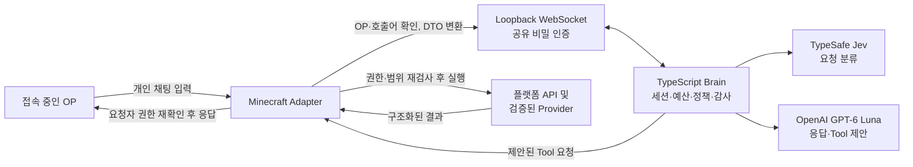

# Minecraft JARVIS 아키텍처

갱신일: 2026-09-26
범위: Paper, Fabric, NeoForge Adapter, 공통 Java runtime, TypeScript Brain, protocol contract와 optional Paper Provider의 현재 구조.
규범 문서: [`Minecraft_JARVIS_WORK_SPEC.md`](Minecraft_JARVIS_WORK_SPEC.md), [`protocol.md`](protocol.md), [`tools.md`](tools.md).

## 문서 역할

이 문서는 **현재 소스 구조와 책임 경계**만 설명한다. 특정 commit SHA, worktree 진행률, release gate, 일회성 테스트 결과는 기록하지 않는다. 그런 시점별 증거는 `docs/verification/`에 보존한다.

규범적 제품 범위는 `Minecraft_JARVIS_WORK_SPEC.md`, wire contract는 `protocol.md`와 `protocol/schema/protocol.schema.json`, Tool 계약은 `tools.md`, 장기 설계 결정은 `docs/decisions/`을 따른다. Jev + Luna 이중 모델과 권한 경계는 [ADR-0005](decisions/0005-jev-luna-routing-authority-boundary.md)에 고정한다.

## 목적과 구성 요소

JARVIS는 접속 중인 OP의 직접 호출을 받아 Minecraft 서버의 제한된 정보를 조회하고, 허용된 단일 행위인 요청자 본인의 텔레포트를 처리한다. Brain은 모델과 대화 흐름을 관리한다. Adapter는 서버가 가진 권한과 현재 상태를 기준으로 모든 실제 접근과 변경을 집행한다.

| 구성 요소 | 책임 | 의존 경계 |
|---|---|---|
| Paper Adapter | `minecraft/paper`: plugin entrypoint/config, chat session/listener, scheduler/platform access, Tool service, Brain connection, optional Provider assembly | `IntegrationRegistry`가 CoreProtect와 WorldGuard를 enabled 상태 및 WorldEdit 의존성에 따라 선택 로딩한다. Provider Tool은 성공적으로 초기화된 경우에만 원자적으로 등록하며, 외부 API 연결 실패 시 미노출한다. |
| Fabric Adapter | `minecraft/fabric`: server mod entrypoint/config, chat session/controller, scheduler/platform access, tick sampler, Tool service, Brain connection | Fabric server API에 한정한다. 클라이언트 전용 API에 의존하지 않는다. |
| NeoForge Adapter | `minecraft/neoforge`: dedicated server mod entrypoint/config, chat session/controller, scheduler/platform access, tick sampler, Tool service, Brain connection | NeoForge dedicated server API를 사용한다. |
| Common Java | `minecraft/common`: protocol DTO/codec, shared chat/request binding state, `AdapterBrainConnection`, standard Tool orchestration, deadline, deduplication ledger, requester authority, Tool registry, scheduler SPI, shared-secret WebSocket transport | Minecraft 플랫폼 API를 import하지 않는다. |
| Brain core | `brain/src/core`: actor/session binding, capabilities, serial request scheduler, budgets, Tool allowlist, model/audit ports | serverId/request/session identity를 분리해 관리한다. |
| AI routing | `brain/src/ai`: TypeSafe Jev classifier, deterministic route policy, GPT-6 Luna Responses Tool loop, strict Tool schemas | 모델 출력은 Tool 요청 제안이다. 최종 검사와 실행은 Adapter 경계에서 한다. |
| Brain operations/server | `brain/src/ops`, `brain/src/server`: config, secret masking, rotating JSONL audit, health, daemon composition, authenticated WebSocket server | Node 24 프로세스로 실행하고 listener는 loopback에만 bind한다. inbound/outbound wire message는 canonical JSON Schema 기반 AJV validator를 통과한다. |
| Protocol contract | `protocol/schema`, `protocol/fixtures`: message schema, capability와 Tool 인자·결과, 오류, valid/invalid examples | JSON Schema가 wire 구조의 기준이며 TypeScript runtime schema와 TS/Java contract constants는 generator로 파생한다. |

## 연결 및 요청 흐름

1. Brain이 loopback 주소에서 WebSocket 서버를 연다. Adapter는 HTTP Upgrade의 `X-Jarvis-Secret` 헤더로 공유 비밀을 제시한다. 빈 값, 샘플 값, 인증 실패는 거부한다.
2. 연결이 인증되면 Adapter와 Brain이 `hello`를 교환한다. Adapter는 플랫폼 및 서버 버전을 알리고, Brain은 protocol 1.0을 수락한다. Adapter는 매 연결마다 현재 runtime에서 실제 사용 가능한 `capabilities`와 Tool 목록을 보낸다.
3. Adapter는 입력을 받기 전 현재 접속·OP 상태를 확인한다. `자비스`, `jarvis`, `재비스` 독립 호출어로 대화가 시작되며, OP별 세션은 직접 호출 후 120초간 유지된다. `대화 끝`, `!내용`, 비OP 채팅은 계약대로 처리한다.
4. Adapter는 실제 플레이어 UUID와 대화 입력을 `chat.message`로 보내고, Brain은 server/request/session/requester 바인딩과 직렬화·요청 한도를 확인한다. 이 정보는 식별 및 binding에 쓰이며 그 자체가 권한을 부여하지 않는다.
5. Jev는 요청을 분류한다. 분류 결과는 도구 후보를 좁힐 뿐이다. Luna는 제한된 Tool 목록에서 호출을 제안하고 결과를 설명한다. 두 모델 모두 권한·승인·대상 선택의 모호성 해소를 단독으로 확정하지 않는다.
6. Brain은 capability, Tool allowlist, schema 및 정책을 확인한 뒤 `tool.request`를 보낸다. Adapter는 실행 직전에 OP, 접속 여부, 대상의 UUID·월드·범위, capability, action 중복을 다시 검사한다.
7. Adapter는 필요한 플랫폼 scheduler에서 제한된 snapshot을 만들거나 변경 작업을 수행한다. 결과는 `tool.result`로 돌아오며 Brain은 결과에 근거해 최종 응답을 구성한다. Adapter는 응답 전 OP와 접속 상태를 다시 확인하고 요청자에게만 개인 전달한다.

세션별 요청은 순차 처리한다. 기본 제한은 세션당 실행 1건·대기 2건, 서버당 진행 대화 4건, 전체 대기 16건, 요청당 Tool 8회, 모델 왕복 4회, 전체 deadline 30초다. 상세한 envelope 필수 필드, 상태 전이, queue 처리, 취소 및 재시도 의미는 [`protocol.md`](protocol.md)를 따른다.

## 권한과 Tool 경계

권한의 단일 기준은 플랫폼 서버가 현재 인정하는 OP 상태다. 접수 직전, Tool 실행 직전, 결과 전달 직전에 다시 확인한다. deop, logout 또는 disconnect가 감지되면 세션을 폐기하고 후속 Tool과 결과 전달을 중단한다.

v0.1 Tool catalog는 아래 조회와 저위험 변경으로 제한한다.

| 기능 | 동작 | 핵심 제한 |
|---|---|---|
| 서버 상태, 온라인 플레이어, 플레이어/위치, 주변 플레이어, 월드 정보 | 읽기 | 요청 범위·목록 상한을 적용한다. 미지원 metric은 `null`이며 추측하거나 chunk를 새로 로드하지 않는다. |
| `teleport_staff` | 상태 변경 | `requesterUuid`가 항상 이동 주체다. 온라인 플레이어의 현재 위치로만 이동하며, 실제 이동 요청이 있는 경우에만 제안한다. |
| 이력 조회 | v0.1.1 읽기 | CoreProtect 공개 API를 쓴다. 반경·시간·결과 상한을 적용한다. |
| Region/보호 조회 | v0.1.1 읽기 | WorldGuard 공개 query API 및 bypass 확인을 사용한다. |
| `get_cmi_player_info` | T14 선택형 읽기 | 활성 CMI API를 통해 온라인 UUID 한 명의 nickname과 AFK 상태만 조회한다. 오프라인 기록, play time, warning은 제외한다. |
| 승인형 rollback | 별도 게이트 | preview/승인/저널 계약 검증 전까지 노출하지 않는다. |

모든 Tool은 versioned allowlist와 strict arguments를 사용한다. 임의 console command, SQL, 코드, 파일 접근, 임의 좌표 텔레포트, 다른 플레이어 강제 이동, ban/warn 및 v0.1 rollback은 제품 Tool로 제공하지 않는다. Tool 결과의 `OK`, `EMPTY`, `ERROR`, `UNSUPPORTED` 상태와 오류 코드는 실제 관측 결과를 반영한다.

## 스레드 및 데이터 경계

- 모델 HTTP, WebSocket, 감사 파일 및 DB 작업은 Minecraft tick/server thread를 막지 않는다.
- 플랫폼 API는 해당 플랫폼에서 요구하는 server execution context에서만 호출한다. 비동기 event callback에서는 안전하게 확보한 입력만 가져오고 API 접근은 scheduler를 통해 수행한다.
- Adapter는 플랫폼 객체를 짧은 범위에서 사용하고 Brain으로는 필요한 DTO만 전달한다. 온라인 상태, 좌표, 지표는 관측 시각과 출처를 포함하며 오래된 상태를 현재 상태인 것처럼 재사용하지 않는다.
- AI에는 문제 해결에 필요한 최소 데이터만 보낸다. IP, 토큰, 개인 채팅, 전체 서버 로그와 비밀은 기본 전송 대상에서 제외한다.
- 감사는 요청자·서버·request/Tool/action ID, 검증 인자 요약, 결과·출처·latency·모델·fallback 원인을 기록한다. 비밀과 전체 프롬프트는 기록하지 않는다. 변경 실행은 선행 감사 기록을 안전하게 남길 수 없으면 거부한다.

## 연결 장애와 불확실한 결과

- WebSocket 재접속 때 `hello`와 capability를 다시 교환한다. 이전 연결의 세션이나 대기 action을 부활시키지 않는다.
- 만료된 deadline, protocol 오류, 인증 오류, 미등록 Tool은 명시적 오류로 거부한다. 모델/API 키와 stack trace를 플레이어 응답에 포함하지 않는다.
- Jev timeout/오류/저신뢰에서는 재질문하거나 제한된 조회 전용 경로만 사용한다. 변경 Tool은 제공하지 않는다. Luna 장애 시 고정 장애 응답을 사용한다.
- 조회 요청만 제한적으로 retry한다. SDK와 앱의 중첩 retry로 요청량을 증폭하지 않는다.
- 상태 변경의 ACK가 유실되거나 timeout으로 결과가 불명확하면 `OUTCOME_UNKNOWN`을 반환한다. 이 결과를 성공/실패로 바꾸거나 자동 재실행하지 않는다.

## 현재 구현 경계와 검증 문서

현재 구현은 세 플랫폼 Adapter, 공통 Java runtime, TypeScript Brain, Jev + Luna routing, authenticated loopback WebSocket, 표준 Minecraft Tool과 Paper optional Provider를 포함한다. 플랫폼 공통 chat session/request binding/connection/standard Tool orchestration은 `minecraft/common`에 있고, 실제 Minecraft API와 scheduler 진입은 각 플랫폼 모듈에 남는다.

Brain의 `AdapterPort.isRequestBindingActive`는 현재 WebSocket 연결의 requester/request/session binding이 살아 있는지만 확인한다. 이 값은 Minecraft OP 권한의 증거가 아니다. 현재 online + OP 여부와 실제 Tool 실행 허가는 Adapter/CommonRuntime이 서버 API를 기준으로 재검사한다.

wire 구조와 고정 protocol limit은 `protocol/schema/protocol.schema.json`을 source of truth로 삼는다. Brain production WebSocket은 여기서 생성된 schema module을 AJV로 검증하고, TypeScript/Java의 공유 contract constants도 generator로 파생한다. 세션 TTL과 request deadline 같은 제품 정책은 `config/v0.1-policy.json`에서 생성한다.

검증 결과는 architecture에 복제하지 않는다.

- T10 v0.1 acceptance snapshot: [`verification/T10_V01_REPORT.md`](verification/T10_V01_REPORT.md)
- 2026-09-25 로컬 검증 snapshot: [`verification/2026-09-25_LOCAL_VALIDATION.md`](verification/2026-09-25_LOCAL_VALIDATION.md)
- 새 검증은 기존 snapshot을 수정해 현재 상태처럼 만들지 말고, 날짜·작업 범위가 드러나는 새 문서로 추가한다.

## 빌드와 운영

Minecraft 모듈은 `minecraft/common`, `minecraft/paper`, `minecraft/fabric`, `minecraft/neoforge`; Brain은 `brain` TypeScript/Node package다. 기준은 Minecraft 1.21.8/Java 21, Node 24이며 구체 SDK와 plugin pin은 version catalog, lockfile, [`build.md`](build.md), ADR 문서를 확인한다.

Brain 실행 흐름은 `OpsRuntime -> TypeSafeJevClassifier -> OpenAiLunaPort -> JarvisAiModel -> BrainCore -> BrainWebSocketServer`다. 기본 endpoint는 `ws://127.0.0.1:8181/ws`; Adapter가 `X-Jarvis-Secret`으로 접속한다. `OPENAI_API_KEY`, `TYPESAFE_API_KEY`, `JARVIS_SHARED_SECRET`은 Brain 환경에서 주입한다. JSONL audit의 선행 기록이 불가능한 상태 변경은 실행하지 않는다.

구체적인 재현 명령과 운영·장애 절차는 [`operations.md`](operations.md), protocol/tool 의미는 [`protocol.md`](protocol.md)와 [`tools.md`](tools.md), 과거 acceptance 증거는 [`verification/`](verification/) snapshot을 따른다. Build, deterministic test, dedicated server boot, protocol client, GUI client, live model call은 서로 다른 증거 층위로 기록한다.
