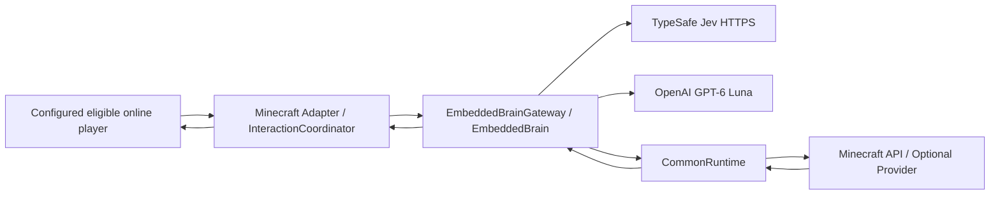

# Minecraft JARVIS Architecture

Last updated: 2026-09-27  
Scope: current Paper, Fabric, and NeoForge Adapter architecture and the in-JVM Embedded Brain.

## Current Architecture

JARVIS runs inside the Minecraft server JVM without a separate Node/Brain daemon. Platform Adapters construct the current online player identity and forward only input that passes `InteractionCoordinator` audience/wake-word/session policy to `EmbeddedBrainGateway`. `EmbeddedBrainGateway` is a lifecycle/API façade: `EmbeddedBrainBootstrap` owns live runtime resource wiring, `GatewayRequestCoordinator` owns request admission/completion flow, `ProactiveInteractionController` owns ACTIVE proactive admission, `GatewayReplyPresenter` owns server-thread delivery/progress/sound, and `GatewayAuditHealthMonitor` owns audit-health reporting. `EmbeddedBrain` remains the request-lifecycle façade; `RequestPlanner` owns Jev/route/reasoning, `ModelConversationLoop` owns Luna rounds/history, `ToolExecutionCoordinator` owns Tool policy/audit/runtime execution, and `ScheduledToolCoordinator` owns schedule registration/cancellation/repeated execution. Minecraft Tool authority is separate from interaction audience and is currently exposed only to online OPs.


```mermaid
flowchart LR
  P["Configured eligible online player"] --> AD["Minecraft Adapter / InteractionCoordinator"]
  AD --> EB["EmbeddedBrainGateway / EmbeddedBrain"]
  EB --> JV["TypeSafe Jev HTTPS"]
  EB --> GPT["OpenAI GPT-6 Luna"]
  EB --> CR["CommonRuntime"]
  CR --> API["Minecraft API / Optional Provider"]
  API --> CR
  CR --> EB
  EB --> AD
  AD --> P
```

WebSocket transport, shared-secret authentication, hello/capabilities handshake, ping/pong, reconnect generation, and the separate Brain process registry were removed in E13/E14.

## Components

| Component | Responsibility |
|---|---|
| `minecraft/common` | lifecycle/API façade `EmbeddedBrainGateway`, `EmbeddedBrainBootstrap`, `GatewayRequestCoordinator`, `ProactiveInteractionController`, `GatewayReplyPresenter`, `GatewayAuditHealthMonitor`, lifecycle façade `EmbeddedBrain`, `RequestPlanner`, `ModelConversationLoop`, `ToolExecutionCoordinator`, `ScheduledToolCoordinator`, Jev/Luna clients, conversation history, request budget/scheduler, audit, runtime-policy config snapshot/validation, `ToolSpec`-based Tool contract/argument validation, `CommonRuntime`, Tool registry, authority/deadline/deduplication |
| `minecraft/paper` | Paper entrypoint, chat/session integration, scheduler/platform access, standard Tool, CoreProtect/WorldGuard/CMI optional Provider |
| `minecraft/fabric` | Fabric dedicated-server entrypoint, chat controller, scheduler/platform access, standard Tool |
| `minecraft/neoforge` | NeoForge dedicated-server entrypoint, chat controller, scheduler/platform access, tick sampler, standard Tool |
| `protocol/schema`, `protocol/fixtures` | static contract assets retained for compatibility/regression analysis of the historical Remote wire contract |
| `evals` | Jev evaluation data and the E12 policy-parity fixture |
| `tests/acceptance/out` | historical live-acceptance evidence snapshots collected in T10 |

## Request Flow

1. The platform Adapter constructs the current online player identity, and `InteractionCoordinator` evaluates the `OP / WHITELIST / ALL / BLACKLIST` audience, configurable wake word, active session, and termination/escape handling.
2. `EmbeddedBrainGateway` delegates to `GatewayRequestCoordinator` as an API façade. The coordinator re-checks current identity and interaction authorization, creates the request, and submits it to the bounded `AiRequestScheduler`. If the requester is not currently an OP, the request's Tool set is fixed to empty.
3. `EmbeddedBrain` prepares request budget/history/lifecycle state and delegates planning to `RequestPlanner`. `ExecutionPolicy` first filters the active Tool set using current runtime configuration, requester Tool authority, and interaction origin.
4. `RequestPlanner` sends the latest message, bounded short topic, interaction origin, and capability names to Jev so `engagement + route + reasoning` are decided in one classification request.
5. `DeterministicRoutePolicy` narrows the execution-filtered Tool set to the route category. Jev errors, `UNCERTAIN`, and low-confidence fallback expose read-only Tools only.
6. `ReasoningPolicy` combines runtime configuration with the Jev result to select `NONE / LOW / MEDIUM / HIGH` for the request and applies the same effort to every Luna model round.
7. `ModelConversationLoop` runs Luna rounds. Luna sees only allowed Tool schemas, and the latest `ExecutionPolicy` is re-applied both on subsequent model rounds and immediately before actual Tool execution in `ToolExecutionCoordinator`.
8. Shared `ToolSpec` is the source of truth for Tool shape/range/schema. `ToolArgumentCodec` and Luna function schemas consume it together. Model output is strictly parsed again through `ToolArgumentCodec` and is not execution authority.
9. A state-changing Tool reaches `CommonRuntime.ExecutionRuntime` only after `ToolExecutionCoordinator` completes pre-execution audit and a fresh `ExecutionPolicy` check. `schedule_action` / `cancel_scheduled_action` and repeated execution lifecycle are handled by `ScheduledToolCoordinator` using the same audit/policy support.
10. `CommonRuntime` re-checks current OP status, active Tool, deadline, deduplication/action semantics, then invokes the real Minecraft/Provider API through the platform scheduler.
11. Luna interprets the Tool result and produces the final response.
12. `GatewayReplyPresenter` returns to the server thread, re-checks current interaction authorization and active session, broadcasts the response to public chat, and handles optional progress/sound feedback. `EmbeddedBrainGateway` retains only the lifecycle/API façade for this flow.

## Authority and Safety Invariants

- The source of truth for interaction admission is the current online identity plus `AudiencePolicy`. The source of truth for Minecraft Tool authority remains current online + OP state.
- Jev/Luna output, requester UUID strings, and capability names are not authority evidence.
- A Tool is active only if it is actually registered in the current `ToolRegistry`.
- Reject unknown/missing Tool argument fields and invalid UUID/range/selector values.
- Preserve per-session request serialization and bounded queues.
- Preserve at most 8 Tool calls per request, at most 4 model round trips, and a 30-second overall deadline.
- State-changing Tools use fail-closed audit.
- If a state-changing outcome is not determined before the deadline, return `OUTCOME_UNKNOWN` and do not retry automatically.
- Block stale replies after audience removal, de-op, logout, or session end. Tool execution separately re-checks current OP status.
- Do not expose a Provider Tool to Luna unless that optional Provider has been successfully activated.

## Runtime policy configuration

Phase 1 introduced `JarvisConfig`, `JarvisConfigLoader`, and
`ConfigManager` as a non-secret immutable runtime-policy snapshot. Paper
adapts Bukkit YAML values through `PaperJarvisConfigSource`; Fabric and
NeoForge read the optional
`config/jarvisminecraft/jarvis.properties` file through the common
properties source. Missing Fabric/NeoForge policy files use built-in defaults.

Each runtime composition root creates exactly one `ConfigManager` and shares it with
`InteractionCoordinator`, `EmbeddedBrainGateway`, `ReasoningPolicy`,
`ExecutionPolicy`, `SchedulingPolicy`, and operational logging.
Gateway wiring rejects configurations where interaction policy and Brain policy refer to
different `ConfigManager` instances.

Phase 2 consumes the base interaction portion through
`InteractionCoordinator`, `AudiencePolicy`, and `InvocationMatcher`.
Wake words, follow-up TTL, and `OP / WHITELIST / ALL / BLACKLIST` admission
are live.

Phase 8 completes `ACTIVE` mode. Allowed public chat remains normal public
chat while `AmbientConversationTracker` keeps bounded in-memory context.
Only one proactive Jev classification may be in flight at a time, with a
one-second minimum classification interval. Jev receives
`PROACTIVE_CANDIDATE`; only `START_CONVERSATION` at or above the configured
confidence threshold may create a JARVIS session. Jev failure, invalid output,
`IGNORE`, low confidence, audience change, an already-active requester
session, or cooldown all fail closed with no unsolicited reply.

A successful proactive decision starts a requester-scoped follow-up session and
submits bounded ambient context using the `PROACTIVE` origin. The normal
public message is never cancelled.

Phase 3 now consumes the model reasoning portion. `JdkJevClassifier` asks
three typed choice questions in parallel: `engagement`, `route`, and
`reasoning`. `ReasoningPolicy` applies the following precedence:

1. concrete config mode (`NONE / LOW / MEDIUM / HIGH`) wins;
2. `AUTO` uses the validated Jev reasoning choice;
3. Jev error/invalid model/output uses the configured concrete fallback.

The chosen effort is fixed for the whole Brain request, including later Tool
rounds. `DIRECT/FOLLOW_UP/PROACTIVE` are already admitted response paths and
use Jev engagement only as classification metadata. `PROACTIVE_CANDIDATE`
uses `START_CONVERSATION/IGNORE` as the Phase 8 admission signal.

Phase 4 now consumes the response portion. AI final/error replies and delayed
progress messages use a platform-neutral `StyledChatMessage`. Only the
configured prefix interprets legacy Minecraft ampersand codes
(`&0..&f`, `&k..&o`, `&r`); model-generated body text remains plain.

If a request exceeds `waiting-message.threshold-ms`, one progress message is
queued. Completion marks the progress handle before final delivery, and the
server-thread delivery path checks it again so a late progress message cannot
appear after the final response.

When response sound is enabled, final/error chat stays public while the sound
is played only to the requester. Sound feedback failure is non-critical.

Phase 5 now consumes `jarvis.execution.*` through `ExecutionPolicy`.

- `READ_TALK`: active read-only Tools only.
- `EXECUTE_LITE`: read-only Tools plus explicitly allowlisted LOW-risk state-changing Tools.
- `EXECUTE`: read-only Tools plus explicitly allowlisted state-changing Tools.
- selected-mode `deny-tools` overrides allow and may also hide read-only Tools.
- non-OP requesters still receive no Minecraft Tools regardless of mode.
- proactive origins are hard-blocked from state-changing Tools.

Allow/deny entries use exact `ToolName.wireName()` values. Unknown names are a
configuration error; allow lists may contain only state-changing Tools, and the
LITE allow list may contain only LOW-risk Tools.

An in-flight request cannot gain newly permitted mutation Tools after it starts.
Policy tightening is re-applied before every model round and again immediately
before Tool execution, including after pre-execution audit.

Phase 6 adds two LOW-risk structured actions to the registered catalog:
`weather_set` and `time_set`. They are available only when the selected
execution mode explicitly allowlists them. Both are rechecked by
`ExecutionPolicy`, pre-execution audit, `CommonRuntime`, current online OP
authority, and the platform loaded-world lookup before mutation.

Phase 7 wires `jarvis.scheduling.*` through Brain-level scheduling controls.
`schedule_action` can defer or repeat only `teleport_staff`,
`weather_set`, and `time_set`. Delay is bounded by the configured maximum
and never exceeds 60 seconds. Repeating schedules require both interval and
duration; duration never exceeds 60 seconds.

Registration returns a schedule ID immediately instead of keeping the original
30-second Brain request open. Every scheduled run receives a new action ID and
short Tool deadline, then rechecks scheduling policy, execution policy, active
Tool registration, pre-execution audit, and current online OP authority through
`CommonRuntime`. Runs are serialized; a failed, denied, cancelled, timed-out,
or outcome-unknown run stops the remaining repetition. Pending schedules are
memory-only and are cancelled on actor invalidation or Brain shutdown.

Admin reload commands are still not wired.

Provider credentials and logical server identity remain in
`EmbeddedBrainSettings`; they are not copied into `JarvisConfig`.
`ConfigManager.reload()` replaces the snapshot only after a complete
successful parse, otherwise the previous valid snapshot remains active.

## Session and Conversation State

`ChatSessionManager` exclusively owns session IDs, TTL, active state, termination, and invalidation. The Embedded Brain does not create a separate session TTL store; it stores only model conversation history in `ConversationHistoryStore`.

The default session TTL is 120 seconds and can be changed with `jarvis.interaction.follow-up-seconds`. The default direct wake words are `자비스`, `jarvis`, and `재비스`, replaceable via `jarvis.interaction.wake-words`. A wake word is accepted only as an independent token at the beginning of the message. The literal commands `대화 끝` and `!내용` are handled locally before any model call.

`WHITELIST` and `BLACKLIST` compare the current online player's exact profile name case-insensitively. A non-OP admitted by the audience may use normal Luna conversation, but the request gets `toolsAllowed=false` and receives no Minecraft Tool schema.

## Tool Boundary

Static Tool metadata is owned by `Protocol.ToolName`; the currently active Tool set is owned by `ToolRegistry`. The original v0.1 state-changing Tool was `teleport_staff`, which moves the requester to the location of an online target player. Phase 6 added structured `weather_set` and `time_set` Tools.

All Phase 6 action Tools are `Risk.LOW` and never construct raw commands. `weather_set` sets one loaded world to `CLEAR / RAIN / THUNDER` for 1–3600 seconds. `time_set` preserves the loaded world's day count while changing only time-of-day in the 0–23999 range. The default `READ_TALK` mode exposes none of these three state-changing Tools to Luna.

CoreProtect, WorldGuard, and CMI features are loaded as optional Providers on Paper. Related Tools are not registered if initialization fails or a dependency is missing.

## Operational Logging

Operational Logging Phases L1–L6 are connected to the shared runtime.

- `JarvisLog` / `ConfiguredJarvisLog` own the shared event/level/category gates, and Paper/Fabric/NeoForge Adapters forward to each platform console logger.
- The default console format is `[JARVIS] event key=value`. `LogSanitizer` removes sensitive keys, OpenAI key patterns, Bearer tokens, newlines, and excessively long values.
- `jarvis.logging.*` controls level, console, request lifecycle, Jev/Luna, Tool, proactive, and health categories. In L1–L6, request, Jev/Luna, Tool/policy, scheduling, ACTIVE proactive, and Audit-health events are wired into runtime paths.
- The request path logs `request.accepted/completed/failed`; the planning path logs `jev.completed/failed/fallback`, `routing.resolved`, and `reasoning.resolved`; the model path logs `luna.round_completed/failed`.
- The Tool/policy path logs `tool.exposure_resolved`, `tool.denied`, `tool.started`, `tool.completed`, and `tool.outcome_unknown`. `ExecutionPolicy` exposes denial codes `NO_REQUESTER_AUTHORITY / READ_TALK / NOT_ALLOWLISTED / DENYLISTED / PROACTIVE_MUTATION_BLOCK / POLICY_CHANGED / TOOL_INACTIVE`.
- The scheduling path logs `schedule.created/run_started/run_completed/cancelled/aborted` and preserves `scheduleId → runIndex → toolCallId/actionId` correlation. Actor invalidation, policy revoke, audit failure, timeout/outcome-unknown, and server stopping use fixed reason codes.
- The ACTIVE proactive path logs `proactive.candidate/accepted/ignored/failed`. Ignored events are DEBUG and contain metadata reasons only, such as cooldown, in-flight limit, Jev ignore, confidence threshold, and actor/session re-checks.
- The Audit health reporter compares health snapshots at `jarvis.logging.health.interval-seconds` and emits `audit.degraded/unhealthy/recovered` only when status or error code changes. `/jm status` is OP-only on Paper/Fabric/NeoForge and exposes runtime/config, AI queue, proactive in-flight, and Audit health summary.
- Do not place raw player chat, Luna prompt/response, or Jev raw body in operational fields. Existing `AsyncJsonlAuditSink` and mutation fail-closed semantics are unchanged.
- Existing direct-construction/test paths default to `NoOpJarvisLog` so functional behavior is unchanged.

## AI and Threading Boundary

Jev and Luna network calls do not occupy the Minecraft server/tick thread. Only platform API calls run in each platform's scheduler/execution context. Jev receives only the latest user message, bounded short topic, interaction origin, and capability names. Luna receives only the bounded conversation, capabilities, and allowed Tool schemas/results needed for request processing. Progress delay waits on the JDK delayed executor, while actual message/sound API calls return to the platform `ServerScheduler`.

## Audit

The Embedded Brain's `AsyncJsonlAuditSink` provides a bounded queue, JSONL rotation/retention, masking, and health state. If a pre-execution record for a state-changing Tool is not actually persisted, execution is denied. Post-execution audit failure never causes retry of an already executed Tool.

## E12–E16 Migration Result

- E12: added policy regression tests so the Remote reference and Embedded Java path pass the same shared parity fixture.
- E13: removed WebSocket transport, shared-secret auth, protocol codec/message DTOs, the request-binding connection registry, and platform Remote wrappers/config.
- E14: removed the TypeScript/Node production Brain, WebSocket server/daemon/CLI, and Node CI job.
- E15: reduced required configuration to the two Provider API keys; logical server IDs are now generated and persisted stably in each platform data directory.
- E16: bundled the official OpenAI Java SDK runtime inside platform artifacts and relocated dependency packages under an internal namespace. Paper/Fabric/NeoForge each have one deployable artifact and clean-server boot smoke coverage.
- Protocol schemas/fixtures, Jev evaluation data, the E12 fixture, and historical T10 evidence are retained for analysis and regression baselines.

The historical Remote transport contract and T10 results are historical verification material. The current production runtime path has no Node process or WebSocket connection.

## Build and Operations

The current production build baseline is Java 21 + Gradle.

```bash
./gradlew build
```

Run real Provider live smoke tests separately when credentials are available.

```bash
OPENAI_API_KEY=... TYPESAFE_API_KEY=... \
  ./gradlew :minecraft:common:embeddedBrainLiveVerification
```

See [operations.md](operations.md) for concrete operational configuration and incident procedures. The Embedded migration decision is recorded in [ADR-0007](decisions/0007-embedded-brain-boundary.md).


## ACTIVE proactive flow — Phase 8

```text
allowed PUBLIC_CHAT
  -> normal Minecraft public chat continues
  -> AmbientConversationTracker
  -> asynchronous Jev(PROACTIVE_CANDIDATE)
  -> START_CONVERSATION + confidence threshold
  -> server-thread recheck: ACTIVE + audience + requester session + cooldown
  -> start requester session
  -> EmbeddedBrain PROACTIVE request
  -> read-only Tool ceiling only
  -> public JARVIS reply
```

ACTIVE proactive classification does not block the Minecraft tick thread.
Paper moves observation through its server scheduler before entering the
gateway; Fabric and NeoForge observe from their server-thread chat callbacks.
Jev HTTP work remains asynchronous.

`ExecutionPolicy` rejects every state-changing Tool for
`PROACTIVE/PROACTIVE_CANDIDATE`, including scheduling control Tools. An OP
proactive turn may still use currently allowed read-only server queries. A
non-OP proactive turn receives no Minecraft Tools.

Proactive turns do not emit delayed progress/waiting messages. Final responses
use the normal public prefix and requester-only sound policy, and the created
session accepts normal follow-up messages.
